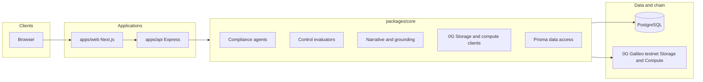

# Prooflane

*A blockchain-backed compliance transparency layer for companies: autonomous agents continuously verify controls, score readiness, and anchor evidence on 0G.*

| Submission item | Details |
|-----------------|--------|
| **Project name** | Prooflane |
| **Short description** | Blockchain-backed compliance automation: multi-framework agent auditors, live control scoring, weighted readiness, evidence bundles anchored via **0G Storage**, executive narratives via **0G Compute** (OpenAI-compatible), public trust pages. |
| **Public GitHub** | [github.com/mbcse/prooflane](https://github.com/mbcse/prooflane) (this repo: README + setup below) |
| **Live demo** | [prooflaneagents.vercel.app](https://prooflaneagents.vercel.app) |
| **Protocol / SDKs** | See [Protocol features and SDKs](#protocol-features-and-sdks) |
| **Contracts / chain** | See [On-chain references (Galileo testnet)](#on-chain-references-galileo-testnet) |

---

## The problem

Modern companies change constantly: new services, refactors, repo settings, policies, vendors, and cloud configurations land every week. Traditional compliance snapshots go stale the moment something ships. A passing audit last quarter does not prove today’s access controls, change-management posture, logging, encryption, or policy coverage. **Drift is normal.** What teams lack is a repeatable way to re-measure controls against live systems and to show *what was checked, when, and with what evidence*, especially when customers and partners ask whether they are interacting with a security-conscious vendor.

Prooflane addresses that gap with **policy-aligned compliance agents** that inspect operational systems, cloud posture, source-control governance, and uploaded policy evidence, then publish a transparent record of what happened. GitHub and AWS are the first live integration surfaces, but the product is built around a broader principle: companies should be able to prove their current security posture with fresh checks, structured findings, and verifiable evidence instead of static claims.

The blockchain layer makes the system more transparent. Evidence bundles can be content-addressed and anchored through **0G**, creating references that buyers, partners, and internal reviewers can inspect when they want confidence that a company’s published posture maps to real artifacts. Outputs support customer trust pages, internal governance, and security questionnaires. They complement qualified audits and counsel; they are not a substitute for formal certification.

---

## What Prooflane delivers

| Capability | Description |
|------------|-------------|
| **Agents that track reality** | Compliance agents map framework lenses (SOC 2-oriented, GDPR, PCI DSS, HIPAA) to concrete checks on your operating environment so reassessment reflects current configuration, not last month's spreadsheet. |
| **Transparent runs** | Each assessment logs phases (integrations loaded, controls executed, evidence packaged, report generated) and stores per-control PASS, FAIL, or UNKNOWN with messages and structured evidence. Stakeholders see what the engine did, not a black-box score. |
| **Verifiable evidence** | Evidence bundles can be anchored with content-derived hashes and **0G** chain references so independent parties can correlate published posture with tamper-evident artifacts. |
| **Multi-lens assessments** | Run scoring passes against the same underlying control library; each lens activates controls tagged for that program. |
| **Live integrations** | Uses connected systems as evidence sources. Current checks cover GitHub repository governance, AWS IAM, CloudTrail and S3 posture, plus uploaded policy documents. |
| **Weighted readiness score** | Aggregates PASS, FAIL, and UNKNOWN results into a single 0-100 score with category breakdowns. |
| **Evidence and reporting** | Persists per-control results, structured JSON evidence, and an executive narrative grounded in actual findings. |
| **Progress visibility** | Server-side activity logs show phases, integration status, per-control outcomes, and report generation for operators running assessments. |
| **Public trust surface** | Organization-scoped pages summarize posture so buyers and partners can quickly understand how your company proves security readiness. |
| **Webhooks** | GitHub push events can trigger compliance runs so evaluations stay aligned with changes to protected branches and repository configuration. |

---

## Architecture

Prooflane is an **npm workspaces monorepo**: a Next.js product surface, a Node API, and a shared core library that runs compliance agents, stores evidence, and integrates with 0G infrastructure.



- **`apps/web`:** Dashboard, onboarding, GitHub and AWS connection flows, compliance run launcher with live activity, run history and detail views, authentication (NextAuth-style session), public trust pages.
- **`apps/api`:** REST API for organizations, integrations, compliance runs, reports, and GitHub webhook ingestion.
- **`packages/core`:** Control definitions, evaluators (GitHub API, AWS SDK, policy document analysis), scoring, compliance orchestration, Prisma access, **0G Storage** uploads for evidence bundles, **0G Compute** for the executive narrative layer when configured, plus compatible OpenAI-style routers where teams standardize on them, and report grounding so prose matches measured results.

**Database:** PostgreSQL via Prisma (managed Neon or self-hosted). The schema covers users, organizations, integrations, compliance runs with optional progress logs, control results, policy uploads, and structured reports.

---

## How an assessment run works

1. **Organization context.** Prooflane loads company context, linked integrations, and policy artifacts. GitHub and AWS provide the current live system signals. Missing scopes surface as UNKNOWN where evidence cannot be collected.
2. **Lens selection.** You choose a framework lens (`soc2`, `gdpr`, `pci`, `hipaa`). The engine filters to controls that apply to that lens.
3. **Evaluation.** For each control, evaluators call GitHub or AWS APIs or analyze uploaded policy text. Results are PASS, FAIL, or UNKNOWN with human-readable messages and structured evidence payloads.
4. **Evidence bundle.** Results are serialized into a single bundle (run metadata, timestamps, per-control outcomes). The bundle is uploaded through **0G Storage** when Galileo RPC, indexer, and wallet keys are configured. Uploads are content-addressed; a root hash and transaction hash tie the bundle to chain activity. If the network path does not complete within policy timeouts, the run still records a content fingerprint so scoring and reporting are never blocked.
5. **Scoring.** A weighted formula produces an overall readiness score and category-level statistics.
6. **Report.** A structured narrative is produced through **0G Compute** when it is configured for your deployment, or through an OpenAI-compatible router. Output is **grounded**: generated copy is merged with live metrics so scores and remediation items stay faithful to evaluation results.
7. **Persistence.** Reports, scores, hashes, and explorer links are stored on the compliance run for audit trails and UI display.

---

## Control library (overview)

The product ships **twelve technical controls** across three domains:

- **GitHub and change management:** Branch protection, required reviews, status checks, CODEOWNERS, secret-pattern heuristics on tracked files.
- **AWS and infrastructure:** CloudTrail enablement, S3 encryption and public access posture, root account MFA and access keys, IAM password policy.
- **Policies and governance:** Presence and content signals for uploaded security and incident-response documents.

Controls carry framework tags (for example SOC 2, ISO 27001 themes, GDPR, PCI, HIPAA) so each agent lens maps measurable checks to the narrative customers, partners, and internal reviewers expect.

---

## 0G (decentralized infrastructure)

Prooflane integrates with **0G** on **Galileo testnet** to make compliance evidence more transparent and independently inspectable:

1. **0G Storage.** Evidence bundles are written through the official TypeScript SDK and indexer. Successful uploads yield a root hash and transaction hash used as tamper-evident references and explorer links (Galileo transaction URLs).
2. **0G Compute.** The executive narrative layer calls 0G Compute through its standard OpenAI-compatible API surface when you enable it in your environment. Teams may also route the same contract through a compatible gateway using their own credentials.

The result is a product experience where a company can present compliance posture with the underlying evidence trail, not just marketing language.

Environment variables and operational notes live in **`.env.example`**. Funding testnet wallets through the public faucet is required for storage fees and compute ledger usage.

---

## Protocol features and SDKs

| Layer | What Prooflane uses |
|-------|---------------------|
| **0G Storage** | Official **`@0gfoundation/0g-storage-ts-sdk`**: content-addressed evidence bundles (`MemData` + indexer upload), root hash and chain-facing transaction hash, explorer URLs consumed by the UI. |
| **0G Compute** | **`@0gfoundation/0g-compute-ts-sdk`** (CLI/setup scripts at repo root) plus **`openai`** client against the OpenAI-compatible **ZG Compute** service URL for grounded executive JSON narratives merged with live scores. |
| **Chain access** | **`ethers`** against Galileo EVM RPC for signing storage flows and compute wallet flows configured in `.env`. |
| **Cloud evidence** | **AWS SDK** (`CloudTrail`, `IAM`, `S3`, `STS`) for infrastructure checks when AWS is connected. |
| **Repo evidence** | **GitHub REST API** via integration tokens for branch protection, reviews, and governance signals. |
| **Data** | **PostgreSQL** + **Prisma** (`@prisma/client`) for orgs, runs, controls, reports, progress logs. |
| **Product surface** | **Next.js** (Auth.js session), **Express** API for runs, integrations, webhooks. |

Galileo endpoints used by default are documented in **`.env.example`** (`ZERO_G_EVM_RPC`, `ZERO_G_INDEXER_RPC`, `ZG_RPC_ENDPOINT`, and compute env vars).

---

## On-chain references (Galileo testnet)

Prooflane is an application; you deploy the **web and API**, not a separate custom smart contract for the product logic. On-chain touchpoints are **0G infrastructure** and recorded **transaction hashes** from evidence uploads.

| Item | Value / notes |
|------|----------------|
| **Network** | 0G Galileo **testnet** |
| **EVM RPC (default)** | `https://evmrpc-testnet.0g.ai` |
| **Default 0G Compute provider address** (`OG_COMPUTE_PROVIDER` in `.env.example`) | `0xa48f01287233509FD694a22Bf840225062E67836` |

---

## Example agent (framework)

Agents are plain TypeScript modules that implement **`ComplianceAgent`**: they decide which controls apply (`appliesTo`), supply LLM framing (`systemPromptPrefix`), and register in **`AGENTS`**.

**Registry** ([`packages/core/agents/registry.ts`](packages/core/agents/registry.ts)):

```typescript
import { agent as gdpr } from "./gdpr";
import { agent as hipaa } from "./hipaa";
import { agent as pci } from "./pci";
import { agent as soc2 } from "./soc2";
import type { ComplianceAgent } from "./types";

export const AGENTS: ComplianceAgent[] = [soc2, gdpr, pci, hipaa];

export function getAgent(id: string): ComplianceAgent | undefined {
  return AGENTS.find((a) => a.id === id);
}

export function defaultAgent(): ComplianceAgent {
  return soc2;
}
```

**SOC 2 lens** ([`packages/core/agents/soc2/index.ts`](packages/core/agents/soc2/index.ts)):

```typescript
import type { ComplianceAgent } from "../types";
import { SYSTEM_PROMPT_PREFIX } from "./prompt";

export const agent: ComplianceAgent = {
  id: "soc2",
  label: "SOC 2",
  description:
    "Trust Services Criteria-oriented narrative across the full technical control set (GitHub, AWS, policies).",
  appliesTo: () => true,
  systemPromptPrefix: SYSTEM_PROMPT_PREFIX,
  frameworkMappingLabel:
    "SOC 2 Trust Services Criteria: Common Criteria themes (CC6/CC7/CC8 emphasis; informal mapping)",
};
```

Add a new lens by copying a folder under [`packages/core/agents/`](packages/core/agents/), implementing `ComplianceAgent`, and appending it to `AGENTS`.

---

## Repository layout

```
apps/web/          Next.js UI and API routes for auth
apps/api/          Express API (routes, webhooks)
packages/core/     Domain logic, agents, evaluators, 0G clients, Prisma client output
prisma/            Schema and SQL migrations
scripts/           Operational and deployment helpers
docker-compose.yml Local PostgreSQL and optional containerized app wiring
```

---

## Requirements

- **Node.js** 20+
- **PostgreSQL** (local Docker or hosted)
- For **0G** anchoring on Galileo testnet: RPC URLs, indexer URL, and funded wallet keys for Storage and Compute

---

## Quick start (development)

```bash
npm install
cp .env.example .env
# Set DATABASE_URL, AUTH_SECRET, NEXTAUTH_URL, API URLs as in .env.example

npx prisma migrate deploy
# or: npm run db:push

npm run dev:all
```

The web app and API start together (`dev:all`). Point `NEXT_PUBLIC_API_URL` (or your internal proxy) at the API port your stack uses.

---

## Production and Docker

`docker-compose.yml` provides PostgreSQL and a build path for a containerized web stack. Set secrets and 0G-related variables from your orchestration layer. Run database migrations as part of deploy (`npm run db:migrate`).

---

## Security and compliance posture

- Store **secrets** (database URLs, `AUTH_SECRET`, GitHub OAuth, AWS keys, 0G private keys) in a secrets manager. Never commit `.env`.
- Prooflane surfaces **readiness** and **technical evidence** for company trust workflows. Customers remain responsible for scope, policies, agreements, and formal attestations.
- **UNKNOWN** results indicate inconclusive or missing evidence (for example disconnected integrations). Treat them as open items until remediated or rescanned.

---

## License and support

Provided for hackathon review and deployment evaluation.

---

**Prooflane:** company compliance readiness, transparent agents, anchored evidence, and narratives your buyers can verify.
